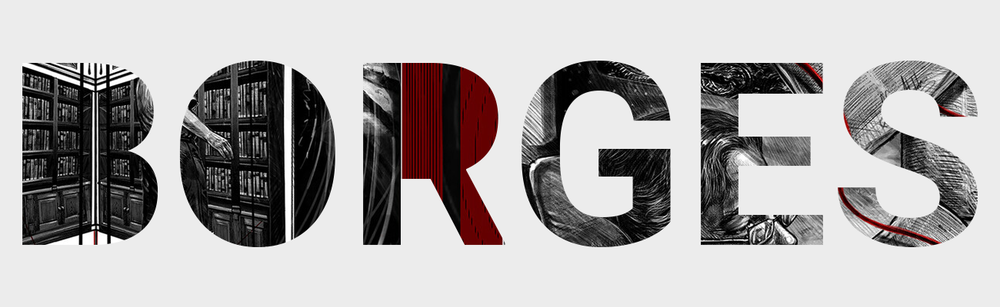

# Borges Editor

##### A Writing Toolkit for the 21st Century Writer.

## Introduction
#### What is the Borges Editor?
The Borges Editor is an application that tries to streamline the creation process for writers. Storyboarding, brainstorming, document organization, automated manuscript generation, and more are intended features for the tool.
Similar tools exist for desktop environments, but a solution needs to be in place to accomodate the 21st century author. 

## The Technical
#### Getting Started

## Usage
TODO

## Boring Stuff
TODO